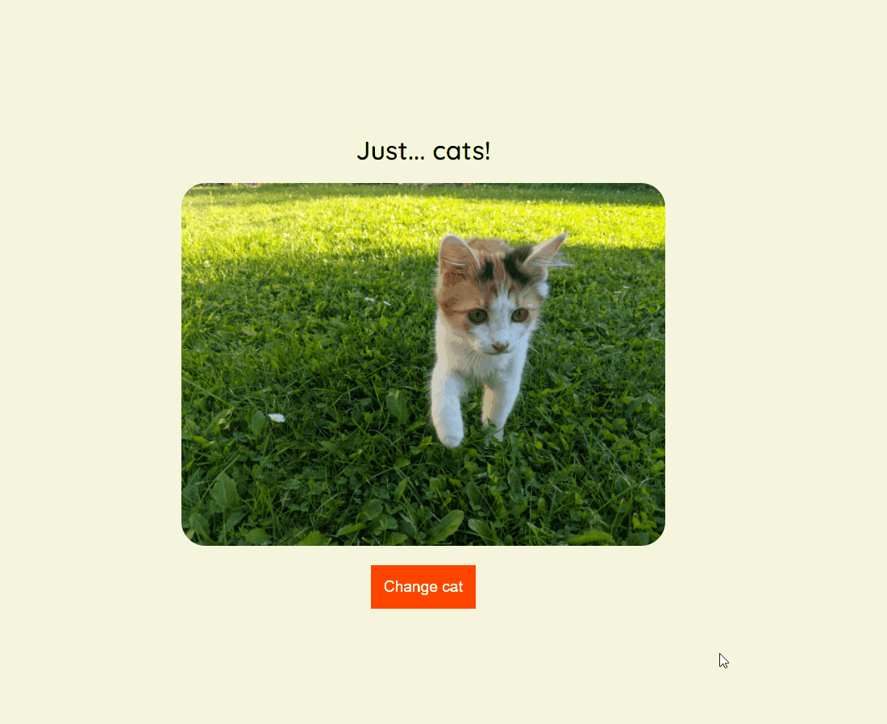

# Javascript Assíncrono

Este repositório contém a atividade prática do Curso "Javascript Assíncrono", que faz parte do Basecamp de Javascript ministrado pela [Digital Innovation One](https://digitalinnovation.one/).

## Atividade: API "catAPI"

Nesta atividade, vamos criar uma página que carrega fotos aleatórias de gatinhos sempre que clicamos em um botão.

1. Utilize a API `https://thatcopy.pw/catapi/rest` para fazer as chamadas com o método `fetch()`;

2. Utilize seus conhecimentos na manipulação do DOM para criar a imagem e ativar o evento de clique do botão!

   **OBS:** Usei a `https://api.thedogapi.com/v1/images/search` pois a url de cima estava fora do ar

## Demo

